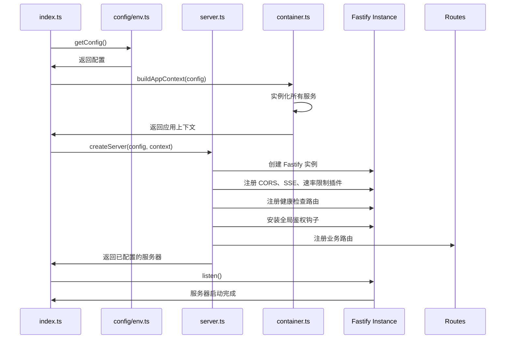
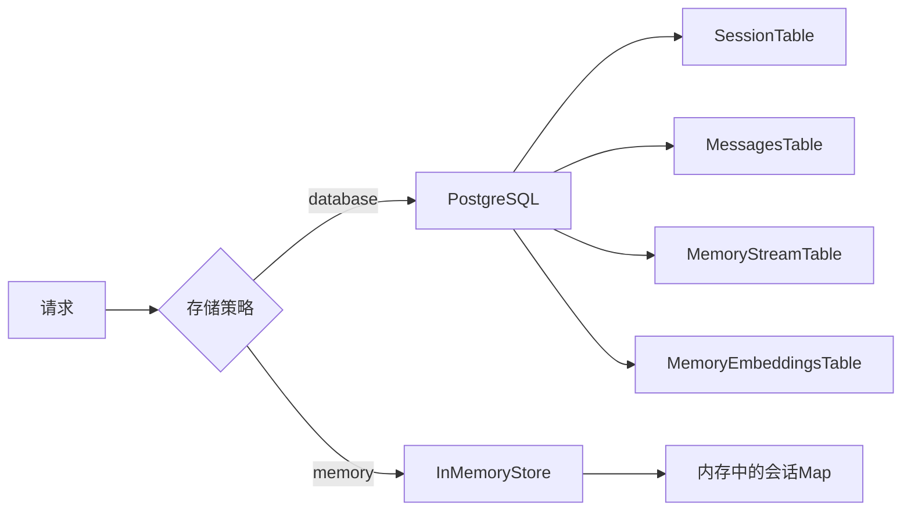
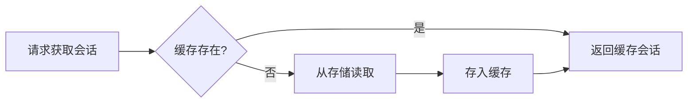
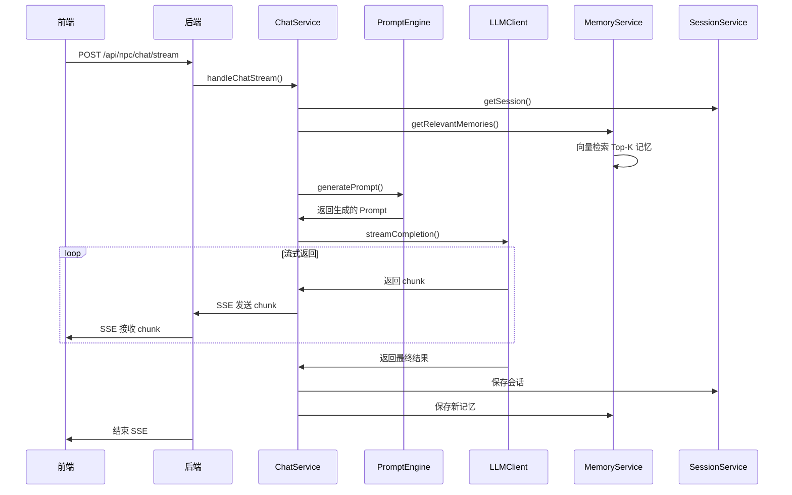

# NPC 后端服务架构开发说明

本文详细介绍 NPC 项目后端服务的技术栈、目录结构、核心组件、数据流以及业务逻辑。阅读完后，你将能够深入理解后端的工作原理，并按现有约定扩展功能。

## 技术栈与基础设施

- **构建/开发工具**：使用 TypeScript + tsx 作为开发环境，pnpm 作为包管理器，提供 `dev`、`start`、`build`、`typecheck`、`test` 等脚本。详见 `backend/package.json`。
- **Web 框架**：Fastify 作为核心 Web 框架，提供高性能的 HTTP 服务、路由管理和插件系统。
- **数据库**：PostgreSQL 作为主要持久化存储，支持 pgvector 扩展用于向量检索；提供 Memory 存储作为降级方案。
- **缓存**：Redis 作为可选会话缓存，提供读写穿透和 TTL 机制。
- **AI 客户端**：封装的 LLMClient 用于与上游模型服务交互，支持流式响应。
- **验证**：Zod 用于请求参数和响应数据的 schema 验证。
- **日志**：Pino 用于结构化日志记录，开发环境下使用 pino-pretty 美化输出。

## 目录总览

```
backend/
├── config/characters/     # YAML 角色定义文件
├── templates/prompts/     # Prompt 模板文件
├── src/
│   ├── cache/            # 会话缓存（Redis 可选）
│   ├── clients/          # 外部服务客户端（LLM）
│   ├── config/           # 环境配置与验证
│   ├── container.ts      # 依赖注入与上下文构建
│   ├── db/               # 数据库连接与初始化
│   ├── routes/           # 路由定义
│   ├── schemas/          # Zod 验证 schema
│   ├── server.ts         # Fastify 服务器构建
│   ├── services/         # 核心业务服务
│   ├── utils/            # 工具函数
│   └── index.ts          # 服务启动入口
└── tests/                # 单元与集成测试
```

## 服务启动流程



## 应用上下文与依赖注入

应用上下文通过 `container.ts` 构建，实现了服务的集中管理和依赖注入：

```typescript
export type AppContext = {
  config: AppConfig;
  services: {
    characters: CharacterService;
    sessions: SessionService;
    prompt: PromptEngine;
    chat: ChatService;
    image: ImageService;
    llm: LLMClient;
  };
};
```

### 服务装配流程

1. CharacterService：加载角色配置文件
2. SessionStore：根据配置选择 database 或 memory 存储
3. SessionService：包裹 SessionStore 并添加缓存层
4. PromptEngine：加载 Prompt 模板文件
5. LLMClient：创建 LLM 服务客户端
6. MemoryService：初始化向量检索服务
7. ChatService：集成 PromptEngine、SessionService、CharacterService、LLMClient 和 MemoryService
8. ImageService：集成 LLMClient、SessionService、AvatarService 与 CharacterService（用于解析后端受控的 image prompts）

## 路由系统与鉴权

### 全局鉴权

所有请求（除健康检查 `/health` 外）都需要携带 `x-api-key` 并匹配配置中的 `NPC_GATEWAY_KEY`：

```typescript
app.addHook('onRequest', async (request, reply) => {
  const path = request.routeOptions?.url ?? request.raw.url ?? '';
  if (path.startsWith('/health')) return;
  const token = request.headers['x-api-key'];
  if (token !== ctx.config.NPC_GATEWAY_KEY) {
    reply.code(401).send({ error: 'UNAUTHORIZED' });
  }
});
```

### 路由列表

- `GET /health`：健康检查
- `GET /api/characters`：角色列表（`languageCode` 支持 `zh` 匹配 `zh-CN` 这类前缀，方便前端使用基础语言码筛选）
- `POST /api/characters/:id/activate`：激活角色会话（附带 `personaId` 与 `personaRuntime` 用于前端初始化）
- `POST /api/npc/chat`：非流式聊天
- `POST /api/npc/chat/stream`：SSE 流式聊天
- `POST /api/npc/images`：图片生成（仅接受 intent/mood，由后端解析提示词）
- `GET /api/npc/sessions/:id`：会话详情
- `GET /api/npc/sessions/:id/messages?limit&cursor`：会话消息游标分页，返回 `items` + `nextCursor`
- `GET /api/npc/memory-stream`：记忆流

## 核心服务与组件

### DigitalPersona v2 集成

- **Schema**：`src/schemas/persona.ts` 定义静态设定（ROM）与运行时状态（RAM），并导出 `DigitalPersonaRuntimePatch` 供增量更新使用。
- **角色加载**：`CharacterService` 解析角色 YAML 中的 `persona` 字段并缓存，未配置时保持向后兼容。
- **会话绑定**：`SessionService` 在创建会话时写入 `personaId` 与初始 `personaRuntime`，并提供 `updatePersonaRuntimeState` 方法在每轮对话后刷新压力计、场景目标等字段。
- **持久化**：DatabaseSessionStore 将运行态 JSON 内嵌到 `sessions.characterState` 列的隐藏键（`__personaRuntime`/`__personaId`）中，无需额外迁移即可恢复数据。
- **Prompt 使用**：PromptEngine/ChatService 可以直接读取 `session.personaRuntime`，把 `scene_context`、`stress_meter` 等上下文注入系统提示词，使 NPC 语气与剧情同步。
- **自动写回**：ChatService 根据 AI 的压力变化计算 `DigitalPersonaRuntimePatch`（当前日期、压力计、触发源），并在 `SessionService.appendTurn` 中一并持久化，保证 RAM 状态始终与最新对话对齐。
- **API 透传**：`/api/characters/:id/activate` 与 `/api/npc/chat(/**)` 会将最新的 `personaId` 与 `personaRuntime` 一并返回，方便前端 Debug Panel 或运营工具直接展示 NPC 的实时心理刻度。

### 1. ChatService

聊天业务的核心服务，处理：
- 消息上下文构建
- Prompt 生成
- LLM 交互
- 会话更新
- 记忆流处理

### 2. SessionService

会话管理服务，提供：
- 会话的创建/读取/更新/删除
- 缓存读写穿透
- 存储策略降级（database -> memory）

### 3. MemoryService

记忆管理服务，实现：
- 记忆的持久化
- 向量生成与检索
- Top-K 相似度匹配

### 4. PromptEngine

Prompt 生成引擎，支持：
- 模板加载与渲染
- 角色属性注入
- 上下文动态组装

### 5. LLMClient

LLM 服务客户端，支持：
- 非流式请求
- SSE 流式响应
- 错误处理与重试
- 响应格式锁定：所有文本补全请求都带有 json_schema response_format，对 AI 输出字段进行强约束
- 容错降级：当上游返回非 JSON（常见于中文自然语言）时记录样本日志并降级为“仅回复最终文本”，避免接口 500

## 新增角色配置指南

1. **复制模板**：以 `config/characters/mob.yaml` 或 `severus_snape.yaml` 为蓝本，新建 `<characterId>.yaml`，确保 `id` 全局唯一（建议使用蛇形英文）。
2. **必填字段**：`id/name/codename/franchise/contextLine/defaultGreeting/defaultState/languages/capabilities/models` 必须存在，`languages` 至少包含一个值（如 `en` 或 `zh`），可以写成 `en (Fluent)` 这类带注释的字符串，服务会自动提取前缀，否则前端用 `languageCode` 过滤时会被排除。
3. **默认状态约束**：`defaultState.stress` 需落在 0~100；`defaultState.trust` 可在 -100~100 表达敌意；`defaultState.mode` 允许任意字符串（例如 `GUARDED`、`MANIPULATIVE`），系统在高压时仍会根据压力值推导出 `NORMAL/ELEVATED/BROKEN` 供回退。
4. **展示与占位**：在 `display.*` 下补充 `title/chatTitle/inputPlaceholder` 等多语言文案，前端会直接使用这些字符串覆盖 UI；未提供时会落回通用占位。
5. **Persona（可选）**：若角色需要 DigitalPersona v2 行为树，把完整 schema 填到 `persona` 字段，系统会在激活时自动加载运行态。
6. **热重载提示**：角色 YAML 目前在进程启动时加载，新增/修改文件后请重新启动 `pnpm dev`（或 `pnpm start`）以让缓存刷新；否则前端 roster 将继续看到旧列表。
7. **前端联动**：Web 端通过 `GET /api/characters?languageCode=xx` 获取 roster，新角色只要满足语言过滤便会自动出现在下拉列表，并在切换时使用 YAML 中的 placeholder/标题。

> Tip：如果角色需要多语言支持，`languages` 和 `display.*` 里的 key 请使用相同的语言码（`zh-CN` 会自动回退到 `zh`）。

## 数据持久化与缓存

### 存储策略



### 缓存机制
### 头像与聊天历史管线

1. `/api/npc/images` 生成的图片始终写入 `character_avatars` 表，并调用 `SessionService.updateAvatar` 保证下次激活立即复用。
2. 同一流程会通过 `attachImageToLastAssistantMessage` 将 `imageUrl` 与 **后端解析出的** `imagePrompt` 贴在最新的助手消息上，前端无需额外轮询也无需传递提示词即可渲染图像。
3. `session_messages` 表为每条消息记录 `messageId`/`createdAt`，`/api/npc/sessions/:id/messages` 使用游标向后翻页，前端可在滚动时带上 `nextCursor` 继续拉取更久远的历史，激活接口只需返回最近几条即可。



## 核心业务流程

### 流式聊天流程



## 开发者工作流建议

1. **启动/调试**：运行 `pnpm dev` 启动开发服务器，默认监听 4000 端口
2. **添加新服务**：在 `services/` 目录下创建新服务类，并在 `container.ts` 中注册
3. **添加新路由**：在 `routes/` 目录下创建新路由文件，并在 `server.ts` 中注册
4. **编码规范**：
   - 使用 TypeScript 严格模式
   - 为所有请求和响应定义 Zod schema
   - 使用 Pino 记录结构化日志
   - 函数和类使用 JSDoc 注释

## 常见扩展场景参考

- **接入新的 LLM 服务**：修改 `clients/llmClient.ts` 或实现新的客户端
- **添加新的记忆类型**：扩展 `MemoryService` 和相关数据库表
- **修改存储策略**：在 `container.ts` 中添加新的 SessionStore 实现
- **添加新的路由**：在 `routes/` 目录下创建新的路由文件

## 架构设计原则

1. **松耦合**：通过依赖注入和接口抽象降低模块间耦合
2. **可扩展**：支持多种存储策略、缓存机制和客户端
3. **高性能**：使用 Fastify、Redis 缓存和流式响应
4. **容错**：提供存储策略降级和错误处理机制
5. **可观测**：全面的结构化日志和健康检查
