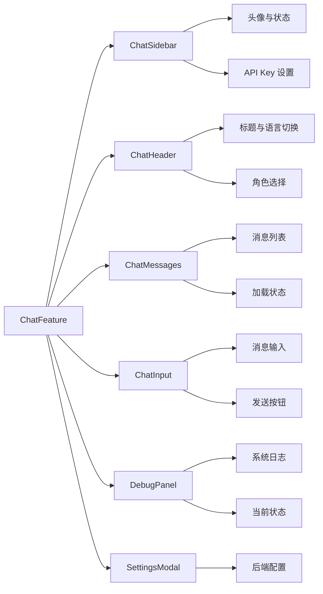
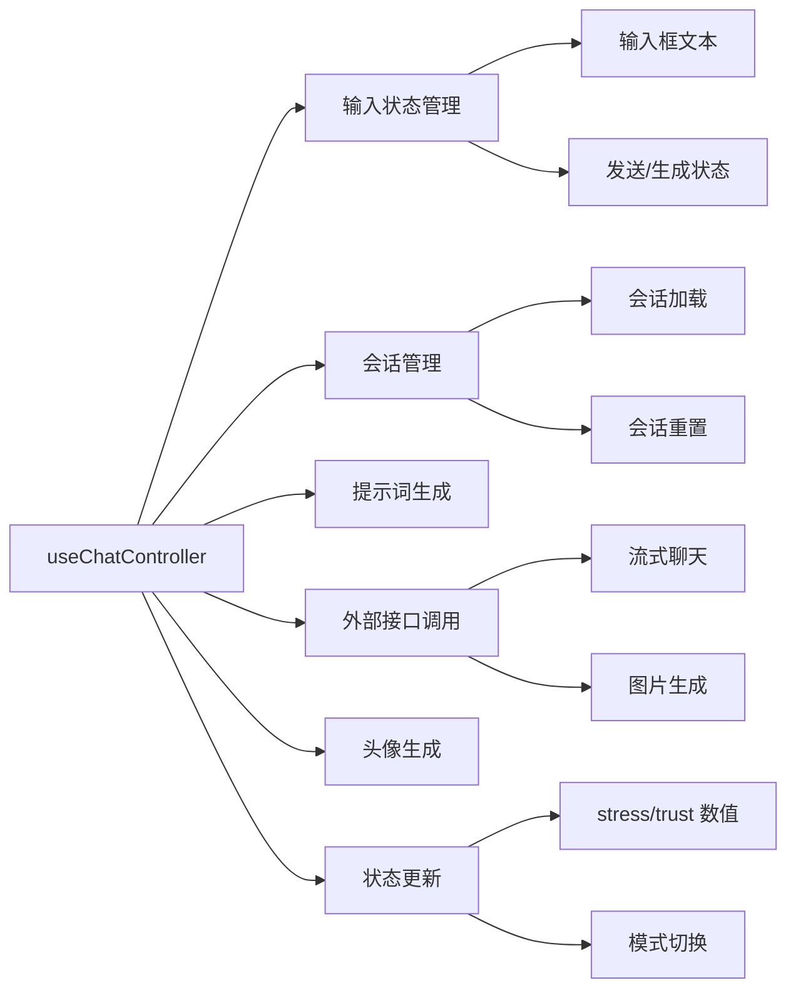
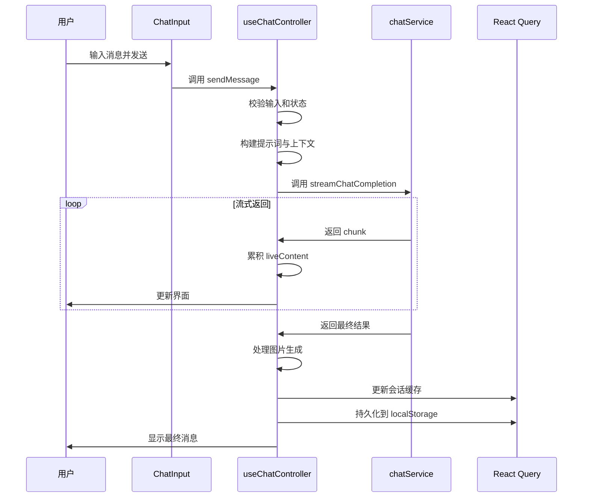
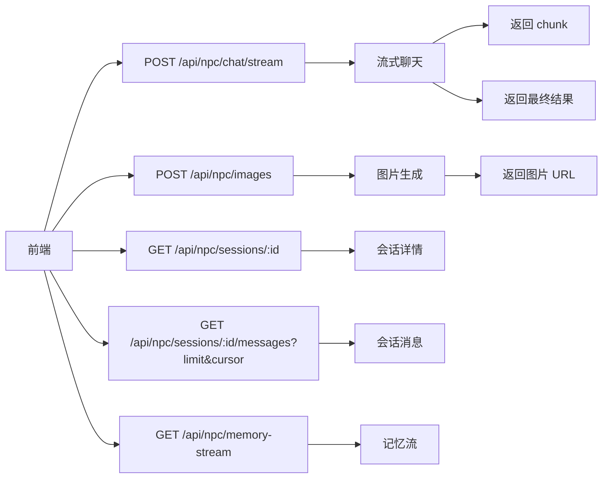
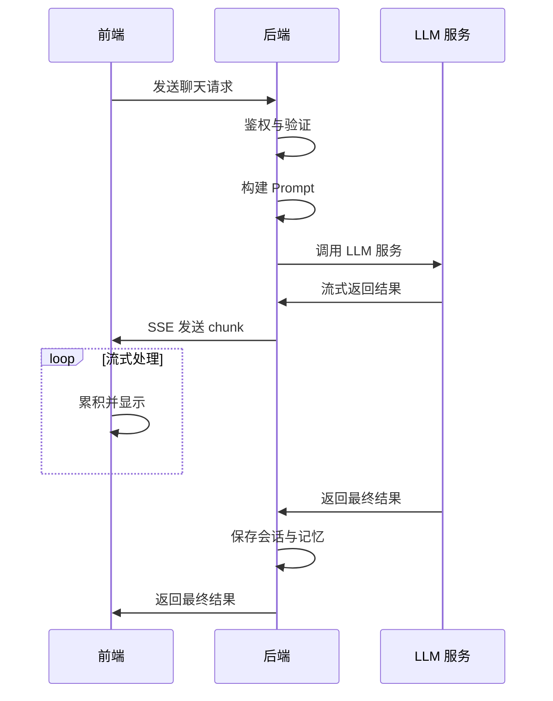
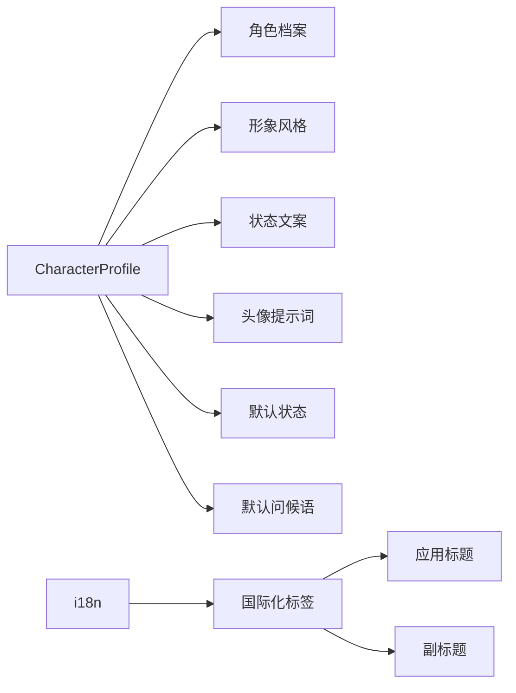

# NPC 前端架构开发说明

本文详细介绍 NPC 项目前端的技术栈、目录结构、核心组件、数据流以及业务逻辑。阅读完后，你将能够深入理解前端的工作原理，并按现有约定扩展功能。

## 技术栈与基础设施

- **构建/开发工具**：Vite + TypeScript 提供快速的开发体验和类型安全，pnpm 作为包管理器，提供 `dev`、`build`、`preview`、`lint`、`format`、`typecheck` 等脚本。
- **框架/路由**：React 18 + React Router 6 实现组件化开发和路由管理。
- **数据请求与缓存**：TanStack Query 提供请求缓存、订阅和失效控制，确保数据一致性。
- **状态管理**：Zustand 用于管理本地 UI 状态和系统日志，轻量且高效。
- **国际化**：i18next 实现多语言支持，支持动态切换。
- **通知/反馈**：Sonner 提供优雅的提示条组件，提升用户体验。
- **UI 组件**：自定义组件系统，结合 CSS Modules 和 Flexbox 实现响应式布局。

## 目录总览

```
web/
├── src/
│   ├── app/              # 应用根组件与路由配置
│   ├── components/        # 通用 UI 组件
│   ├── config/           # 业务配置与常量
│   ├── features/         # 业务特性模块
│   ├── hooks/            # 自定义 React Hooks
│   ├── i18n/             # 国际化配置
│   ├── main.tsx          # 应用入口
│   ├── schemas/           # Zod 验证 Schema
│   ├── services/          # 服务层（API 调用、业务逻辑）
│   ├── stores/            # Zustand 状态管理
│   ├── styles/            # 全局样式与主题
│   └── vite-env.d.ts      # Vite 环境声明
└── docs/                  # 文档
    └── web-arch.md        # 前端架构说明
```

## 应用启动流程


## ChatFeature：核心界面组件

`ChatFeature` 是聊天页面的骨架，负责组织所有子组件与数据流：



### ChatFeature 主要功能

- **布局管理**：组织侧边栏、聊天面板和浮动组件
- **状态管理**：管理 UI 状态、API Key 和系统日志
- **数据加载**：通过 `useChatController` 拉取会话和处理数据流
- **历史翻页**：ChatMessages 顶部“Load older messages”按钮会携带 `nextCursor` 调用 `/api/npc/sessions/:id/messages`
- **国际化**：根据当前语言更新界面文案和标题
- **Fallback 逻辑**：处理角色爆发状态和头像缺失的情况
- **错误处理**：处理鉴权和会话加载失败的情况

## 核心业务钩子

### 匿名鉴权（useAuth）


- 在浏览器 `localStorage` 中生成/缓存匿名用户 ID
- 组件挂载时确保用户存在
- 支持订阅变更，状态更新时触发重渲染

### 会话管理（useChatSession）

- 基于 TanStack Query，`queryKey` 为 `['session', userId]`
- 只有存在 userId 时才会触发加载
- 监听本地存储更新，实时刷新缓存数据

### ChatController：聊天业务中枢

`useChatController` 是聊天业务的核心钩子，封装了所有业务逻辑：



#### 消息发送流程



## 状态管理与持久化

### 状态管理方案


- **UI Store**：使用 Zustand，只持久化 API Key，其余状态为非持久化
- **系统日志**：使用 Zustand，维护最多 200 条调试日志
- **会话数据**：使用 React Query，存在内存 + localStorage，支持订阅与初始默认值

### 持久化策略


- 会话数据持久化到内存和 localStorage
- 页面刷新时从 localStorage 恢复
- 支持订阅变更，实时更新界面

## 与后端交互

### API 接口



### 与后端的交互流程



### RAG 检索（后端实现）

会话与消息存储在 Postgres
长期记忆采用 pgvector 向量检索
按 Top-K 相似度将记忆片段注入 System Prompt

## 角色与文案配置



- `config/characterProfile.ts` 定义角色的各种配置
- 国际化标签和标题通过 `getActiveNpcLocalization` 按语言选择
- 用于 `ChatFeature` 的标题和副标题展示

## 开发者工作流建议

### 启动与调试

```bash
# 启动开发服务器
pnpm dev

# 构建生产版本
pnpm build

# 预览生产版本
pnpm preview

# 类型检查
pnpm typecheck

# 代码检查
pnpm lint

# 代码格式化
pnpm format
```

### 添加新功能

1. **纯展示/交互组件**：在 `features/chat/components` 下新增组件，并通过 `ChatFeature` 组合
2. **数据请求**：在 `services` 中新增纯函数，并在自定义 hook 中封装，利用 React Query 的缓存和订阅机制
3. **状态管理**：若是 UI 级别或调试数据，优先考虑在 `stores` 中扩展 Zustand 状态

### 编码规范

- 使用 TypeScript 严格模式
- 为所有请求和响应定义 Zod schema
- 组件采用函数式组件和 Hooks
- 使用 CSS Modules 进行样式隔离
- 提交前运行 `pnpm lint` 和 `pnpm typecheck`

## 常见扩展场景参考

- **新增角色**：在 `config/characterProfile.ts` 中添加角色配置、模型模板和本地化文案
- **改进消息列表**：在 `ChatMessages` 组件内处理 UI 需求，确保 `liveContent` 预览逻辑保持不变
- **接入新的后端**：在 `services/chatService.ts` 中修改 API 地址和 header
- **新增语言支持**：在 `i18n/` 目录下添加新的语言文件
- **自定义主题**：修改 `styles/` 目录下的全局样式

## 架构设计原则

1. **组件化**：将界面拆分为可复用的组件
2. **状态管理分层**：UI 状态、会话数据、系统日志分离管理
3. **数据一致性**：使用 React Query 确保数据的一致性
4. **可测试性**：业务逻辑与界面分离，便于测试
5. **可扩展性**：模块化设计，便于添加新功能
6. **用户体验**：提供加载状态、错误提示和优雅的交互反馈

通过以上结构，你可以从入口到业务核心快速定位文件，并按职责分层的方式进行修改或扩展。
